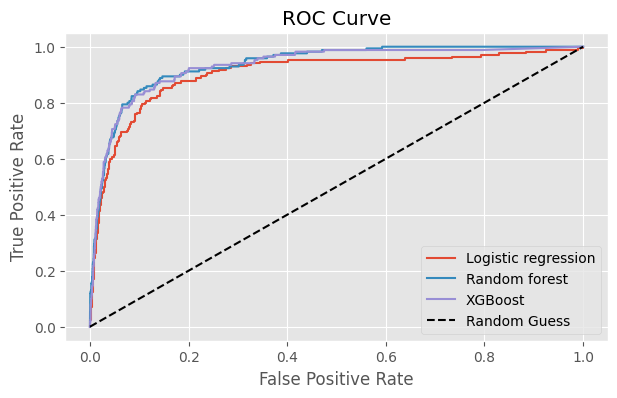

# Bankruptcy Prediction (Imbalanced Classification)

Notebook-driven workflow for predicting corporate bankruptcy (`Bankrupt?`) using financial ratios, heavy class-imbalance mitigation, and threshold tuning. The entire experiment—including EDA, resampling, training, and exports—lives inside `Bankruptcy_Prediction.ipynb`.

## Dataset & Problem
- 5,455 companies, 97 columns (170 bankrupt vs. 5,285 solvent → ≈3% positives).
- Target label is `Bankrupt?`; features are numeric ratios from the public Kaggle dataset.
- Predictions are exported as CSVs for downstream evaluation or competitions.

## Repository Layout
- `Bankruptcy_Prediction.ipynb` – primary notebook (EDA, modeling, exports).
- `assets/` – figures rendered from the notebook and referenced by this README.
- `README.md` – project overview and reproduction guide.
- (Optional) place `train.csv`, `test.csv`, and generated outputs in the repo root or an `artifacts/` folder and update notebook paths accordingly.

## Environment Setup
```bash
python -m venv .venv && source .venv/bin/activate
pip install --upgrade pip
pip install pandas numpy scikit-learn imbalanced-learn xgboost seaborn matplotlib jupyter
```
If you lint notebooks or helper scripts, add `nbqa black` and `black` to the toolchain.

## Running the Analysis
1. Copy training/testing CSVs locally (default cell paths use `/content/...`, so adjust them to relative paths like `./train.csv`).
2. Launch `jupyter lab Bankruptcy_Prediction.ipynb` (or `jupyter notebook ...`).
3. Run cells sequentially; restart the kernel before re-running the modeling block to avoid stale data.
4. Export predictions from the final section (e.g., `rf_bankruptcy_predictions.csv`) and verify metrics against the table below.

## Modeling Workflow & Techniques
1. **EDA** – distributions, Spearman correlation, and key ratios to understand signal.
2. **Imbalance handling** – `RandomOverSampler` on the training split prior to fitting.
3. **Models** – Logistic Regression (`C=1`, `penalty=l1`, `solver=liblinear`), Random Forest (`n_estimators=100`, `max_depth=10`, `min_samples_split=5`), XGBoost (`n_estimators=200`, `learning_rate=0.01`, `max_depth=3`).
4. **Evaluation** – 5-fold cross-validation on probabilities, followed by F1-oriented threshold search plus ROC AUC, accuracy, and confusion matrices.
5. **Selection** – Random Forest provides the published predictions; XGBoost is included for F1 comparisons.

## Results
| Model | Best Threshold | F1 | ROC AUC | Accuracy |
| --- | --- | --- | --- | --- |
| Logistic Regression | 0.202 | 0.420 | 0.903 | 0.961 |
| Random Forest | 0.192 | 0.460 | **0.937** | 0.955 |
| XGBoost | 0.172 | **0.468** | 0.932 | 0.957 |

Choose XGBoost when maximizing F1; prefer Random Forest when ROC AUC and interpretability are valued; Logistic Regression offers a transparent baseline.

## Visual References
Exploratory and evaluation figures are stored in `assets/`:
- 
- 
- 
- 
- 

## Reproducibility Tips
- Keep random seeds (`np.random.seed`, estimator seeds) fixed across runs for comparable metrics.
- Document any feature filtering or preprocessing edits in the notebook markdown blocks.
- Avoid committing raw CSVs; instead, describe acquisition paths and add them to `.gitignore`.

## Contributing / Next Steps
Pull requests should describe the notebook section modified, attach screenshots of new figures, and call out dependency or data-path changes. Potential next steps include adding SHAP-based explainability cells, setting up a lightweight `pytest` suite for helper utilities, or exporting the best model via `joblib` for serving.
